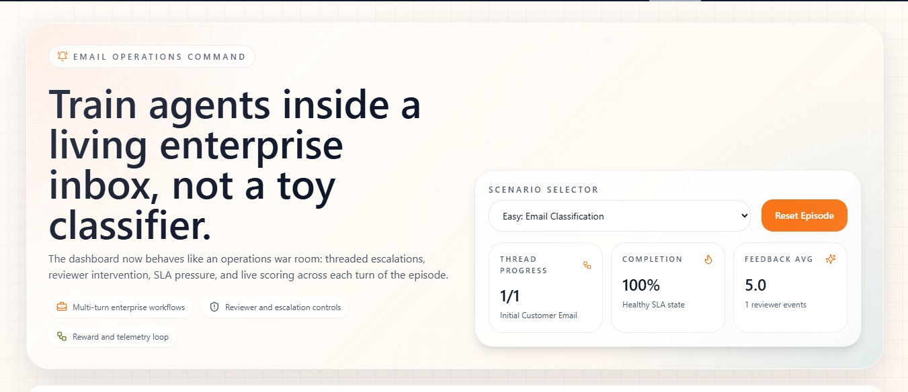

# 🚀 MailMind.ai  
## Enterprise Email Triage Environment (OpenEnv)

<div align="center">


# 📩 Intelligent Enterprise Email Operations Simulation

### A High-Fidelity AI Environment for Enterprise Email Triage, Routing & Decision Intelligence

*Built to simulate real-world enterprise inbox workflows using AI agents, reward systems, SLA pressure, escalation logic, and OpenEnv-compatible architecture.*

</div>

---

# 📸 Project Preview

<div align="center">



</div>

---

# 🔗 Live Demo

## 🚀 Try the Application

https://huggingface.co/spaces/shubhamsalunke/MailMind.ai

---

# 📌 Overview

Modern enterprises receive **thousands of operational emails daily** across domains such as:

- Customer Support
- Human Resources
- Finance
- IT Operations
- Security & Compliance

Managing these workflows manually becomes increasingly inefficient and error-prone.

---

## 💡 MailMind.ai Solves This Problem

**MailMind.ai** is not just an email classification project.

It is a **realistic AI simulation environment** where intelligent agents learn to operate inside enterprise inbox systems under practical operational constraints.

The system enables AI agents to:

- 📩 Understand email intent, urgency, and tone
- 🧠 Perform intelligent routing & prioritization
- 🔁 Handle escalations and multi-turn workflows
- 📊 Operate under SLA pressure
- 🎯 Learn through deterministic reward systems

---

# 🎯 Core Vision

> Build an enterprise-grade AI environment where intelligent agents learn operational decision-making inside realistic inbox ecosystems.

---

# 🧠 Key Features

## ✅ Enterprise-Grade Email Simulation

- Real-world inbox workflow modeling
- Multi-department routing scenarios
- Human-reviewer interaction simulation

---

## 🔁 Multi-Turn Workflow Intelligence

- Escalation handling
- Feedback loops
- Queue pressure simulation
- Stateful workflow transitions

---

## 🚨 SLA-Aware Decision Systems

- Time-sensitive task prioritization
- SLA pressure evaluation
- Urgency-aware routing intelligence

---

## 🧮 Deterministic Evaluation Engine

Evaluates:

- Classification accuracy
- Priority correctness
- Routing precision
- Workflow efficiency

---

## 🎯 Reward-Driven Learning Environment

- Continuous feedback loop
- Partial reward scoring
- Penalty-based operational correction

---

## 🌐 OpenEnv-Compatible Architecture

Designed using standardized environment concepts:

- `reset()`
- `step(action)`
- `state()`

making it extensible for AI agent training research.

---

## 🤖 LLM-Powered Decision Making

Integrated with:

- Hugging Face Router
- OpenAI-Compatible APIs
- Meta LLaMA 3

---

# 🏗️ System Architecture

<div align="center">

```text
Dataset → Environment → Agent → Action → Grader → Reward → Feedback Loop
```

</div>

---

# ⚙️ Architecture Components

# 📊 1. Enterprise Email Dataset

Structured synthetic enterprise email system containing:

- Subject
- Email Body
- Sender Metadata
- Department Labels
- Priority Signals
- SLA Constraints
- Urgency Indicators

Supports realistic enterprise workflow simulation.

---

# ⚙️ 2. OpenEnv Core Environment

The environment controls operational workflow simulation.

## Core Methods

```python
reset()
step(action)
state()
```

## Capabilities

- Stateful conversations
- Escalation logic
- SLA monitoring
- Human-reviewer simulation
- Queue management workflows

---

# 🤖 3. AI Agent Layer

Implemented via:

```bash
inference.py
```

The AI agent:

- Observes inbox state
- Generates operational actions
- Interacts with the environment loop
- Uses LLM reasoning for decision-making

---

# 🧮 4. Grading & Evaluation Engine

Deterministic scoring system evaluating:

- Category classification
- Priority assignment
- Department routing
- Operational correctness

## Output

```python
score ∈ [0.0, 1.0]
```

---

# 🎯 5. Reward System

Continuous reinforcement-style feedback mechanism.

## Rewards

✅ Correct classification  
✅ Correct routing  
✅ Proper SLA prioritization  

## Penalties

❌ SLA violations  
❌ Incorrect escalation  
❌ Wrong department routing  
❌ Ignoring urgency indicators  

---

# 🌐 6. API Layer

## Available Endpoints

```bash
/reset
/step
/state
/health
/metadata
/schema
```

Provides modular environment interaction.

---

# 📊 7. Frontend Dashboard

A visual **Enterprise Email Operations Command Center**.

## Features

- 📬 Live email streams
- 🤖 Agent action visualization
- 🚨 Escalation monitoring
- 📈 Reward telemetry
- 📊 Operational analytics
- 🔄 Workflow tracking

---

# 🎮 Task Difficulty Levels

## 🟢 Easy — Basic Classification

- Single email
- Simple classification & routing

---

## 🟡 Medium — Context-Aware Triage

- Includes urgency & SLA constraints
- Requires contextual prioritization

---

## 🔴 Hard — Enterprise Workflow Simulation

- Multi-turn conversations
- Escalations & reviewer loops
- Operational queue pressure
- Stateful reasoning

---

# 🔄 OpenEnv Interface Design

# 📥 Observation Space

```json
{
  "subject": "...",
  "body": "...",
  "sender_type": "...",
  "sla_hours": 24,
  "urgency_flag": 1
}
```

---

# 📤 Action Space

```json
{
  "category": "human_resources",
  "priority": "high",
  "route": "people_ops"
}
```

---

# 🔁 Environment Step Output

```json
{
  "observation": {...},
  "reward": 0.75,
  "done": false,
  "info": {}
}
```

---

# ⚡ Baseline LLM Setup

## 🧠 Model

Meta LLaMA 3 via Hugging Face Router

---

# 🔐 Environment Variables

```env
API_BASE_URL=https://router.huggingface.co/v1
HF_TOKEN=your_token
MODEL_NAME=meta-llama/Meta-Llama-3-8B-Instruct
```

---

# ▶️ Run Inference

```bash
python inference.py
```

---

# 🚀 Deployment

## Supported Deployment Platforms

- ☁️ Hugging Face Spaces
- 🐳 Docker Containers
- 🌐 Cloud Infrastructure

---

# 🏆 Why MailMind.ai Stands Out

# 🔥 Real Enterprise Relevance

Unlike toy classifiers, MailMind.ai simulates realistic operational inbox systems.

---

# 🎯 Strong AI Evaluation Design

- Deterministic grading
- Multi-level workflow complexity
- Reward-driven evaluation
- Stateful decision environments

---

# 🧩 Advanced System Engineering

- Modular architecture
- Scalable environment logic
- OpenEnv integration
- Enterprise workflow modeling

---

# 💡 Innovation Highlights

- Human-in-the-loop simulation
- Multi-turn reasoning systems
- AI operational intelligence
- Enterprise workflow abstraction

---

# 🔮 Future Roadmap

- 🧠 Long-term agent memory
- 🤝 Multi-agent collaboration
- 🎯 Reinforcement Learning integration
- 📊 Advanced analytics dashboard
- ☁️ Distributed agent orchestration
- 📡 Real enterprise inbox integration

---

# 🧾 Conclusion

MailMind.ai bridges the gap between:

```text
❌ Simple ML Classification Projects
                ↓
✅ Real-World Enterprise AI Decision Systems
```

---

# 💡 Key Insight

> MailMind.ai is not just an email classifier — it is a training ground for intelligent enterprise AI agents operating inside realistic organizational workflows.

---

# 👨‍💻 Author

## Shubham Salunke

### 🚀 AI Engineer • Full Stack Developer • System Architect

Focused on:
- Enterprise AI Systems
- Agentic Workflows
- Intelligent Automation
- AI Environment Simulation
- Scalable System Design

---

<div align="center">

# 📩 Reimagining Enterprise Email Operations with AI

### Intelligent Agents • Operational Reasoning • Enterprise Automation

Made with ❤️ using AI, LLMs & Modern System Design

</div>
